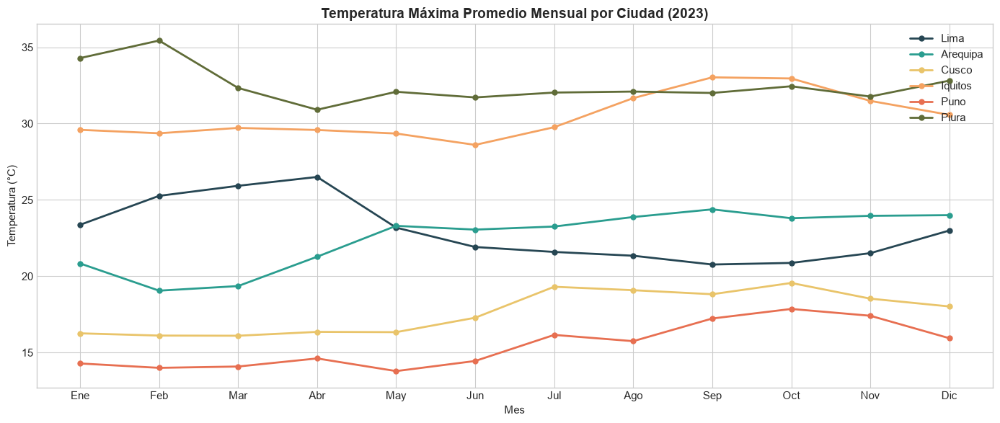
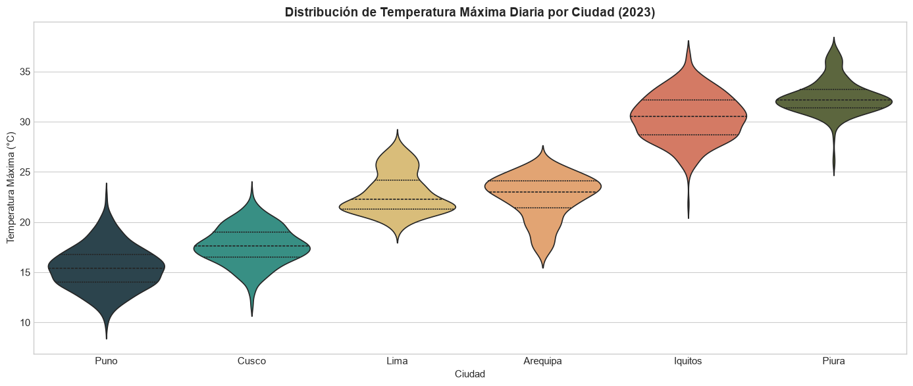
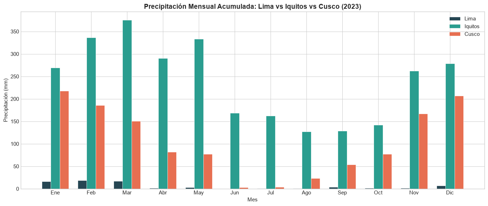

# Data Lake Climático - Perú

¿Sabías que Perú concentra 28 de los 32 climas del mundo según la clasificación de Köppen? En Lima no llueve en 8 meses del año, Iquitos recibe 300 mm de lluvia por mes, y en Juliaca la temperatura puede variar 25°C entre la madrugada y la tarde del mismo día. Todo en un solo país.

Soy Gian Cruz. Estaba buscando una fuente abierta de datos climáticos para Perú y descubrí que Open-Meteo tiene un archivo histórico gratuito con datos diarios de temperatura, precipitación y viento para cualquier coordenada del planeta. El problema: son datos crudos por punto geográfico, sin ningún contexto regional. No puedes comparar directamente el comportamiento climático de Costa, Sierra y Selva, ni detectar eventos extremos como heladas o sequías porque no hay clasificación por encima del dato puntual.

Lo que hice fue construir un data lake que extrae datos climáticos diarios de 26 ciudades peruanas vía la API de Open-Meteo, los organiza en Parquet particionado por región natural y ciudad, calcula amplitud térmica, promedios mensuales, días de lluvia, y detecta eventos extremos automáticamente (olas de calor, heladas, lluvias atípicas). Cada ciudad queda clasificada climáticamente por mes.

El resultado: Puno registra un aumento del 40% en eventos de helada en la última década. Cusco tiene la amplitud térmica más alta del país (25°C de diferencia en un solo día). Y las lluvias extremas en la costa norte se concentran en los mismos meses que los eventos El Niño, con picos de precipitación 8 veces por encima del promedio mensual. Patrones que solo se ven cuando estructuras los datos por región y los cruzas en serie temporal.

Si quieres explorar la data climática o tienes ideas sobre cómo conectar esto con datos de producción agrícola o riesgo de desastres, el código está acá.

## Qué hace

- Descarga datos climáticos diarios de Open-Meteo (archivo histórico)
- Limpia y valida registros eliminando duplicados y valores nulos
- Calcula amplitud térmica, promedios mensuales y días de lluvia
- Clasifica zonas climáticas por ciudad y mes
- Detecta eventos extremos: olas de calor, heladas, lluvias atípicas
- Almacena todo en un data lake Parquet particionado

## Estructura del lake

```
data/lake/
├── daily/
│   ├── region=Costa/
│   │   ├── ciudad=Lima/weather.parquet
│   │   ├── ciudad=Trujillo/weather.parquet
│   │   └── ...
│   └── region=Sierra/
│       ├── ciudad=Cusco/weather.parquet
│       └── ...
├── monthly/
│   ├── ciudad=Lima/stats.parquet
│   └── ...
└── events/
    ├── tipo=ola_calor/extreme.parquet
    ├── tipo=helada/extreme.parquet
    └── tipo=lluvia_extrema/extreme.parquet
```

## Instalación

```bash
python -m venv venv
source venv/bin/activate
pip install -r requirements.txt
```

## Uso

```bash
# Pipeline completo (26 ciudades, año 2024)
python -m src.pipeline

# Ciudades específicas
python -m src.pipeline --cities Lima Cusco Iquitos

# Rango de fechas personalizado
python -m src.pipeline --start 2023-06-01 --end 2023-12-31
```

## Tests

```bash
pytest tests/ -v
pytest tests/ --cov=src --cov-report=term-missing
```

## Stack

- Python 3.10+
- pandas + numpy para procesamiento
- requests para consumo de API
- pyarrow para escritura/lectura Parquet
- pytest para testing

## Estructura del proyecto

```
datalake-clima-peru/
├── src/
│   ├── config/
│   │   └── settings.py        # Ciudades, URLs, parámetros
│   ├── extract/
│   │   └── api_client.py       # Cliente Open-Meteo con retry
│   ├── transform/
│   │   ├── cleaner.py          # Limpieza y merge de datos
│   │   └── enricher.py         # Métricas y detección de eventos
│   ├── load/
│   │   └── parquet_writer.py   # Escritura particionada al lake
│   ├── utils/
│   │   └── logger.py
│   └── pipeline.py             # Orquestador principal (CLI)
├── tests/
├── data/
│   ├── raw/                    # JSON crudos por ciudad
│   ├── lake/                   # Parquet particionado
│   └── processed/              # CSVs de resumen
└── requirements.txt
```

---

## What it does

Pipeline that builds a climate data lake for 26 Peruvian cities using Open-Meteo historical archive API. Data is stored as partitioned Parquet files organized by region and city.

Peru has 28 of the 32 world climates (Köppen classification). This project captures that diversity by analyzing temperature, precipitation, wind and extreme weather events across the three natural regions: Coast, Highlands, and Jungle.

## Features

- Daily weather data extraction from Open-Meteo archive API
- Data cleaning with duplicate removal and null handling
- Thermal amplitude calculation and monthly aggregation
- Climate zone classification per city/month
- Extreme event detection (heat waves, frost, heavy rainfall)
- Partitioned Parquet data lake storage

---

## Fuentes de datos

| Fuente | Descripción | Enlace |
|--------|-------------|--------|
| Open-Meteo Archive API | Datos climáticos históricos diarios (temperatura, precipitación, viento) | [https://open-meteo.com/en/docs/historical-weather-api](https://open-meteo.com/en/docs/historical-weather-api) |
| Open-Meteo | Plataforma de datos meteorológicos abiertos | [https://open-meteo.com/](https://open-meteo.com/) |

## Visualizaciones

Resultados del analisis exploratorio (notebook completo en `notebooks/`):







## Licencia

MIT

---

# Climate Data Lake - Peru

Did you know Peru has 28 of the world's 32 climates according to the Koppen classification? In Lima it doesn't rain for 8 months a year, Iquitos gets 300 mm of rainfall per month, and in Juliaca the temperature can swing 25°C between dawn and afternoon on the same day. All in one country.

I'm Gian Cruz. While looking for open climate data sources for Peru, I discovered that Open-Meteo has a free historical archive with daily temperature, precipitation, and wind data for any coordinate on the planet. The problem: it's raw data by geographic point, with no regional context. You can't directly compare climate behavior across Coast, Highlands, and Jungle, or detect extreme events like frosts or droughts because there's no classification above the raw data point.

What I built is a data lake that extracts daily climate data for 26 Peruvian cities via the Open-Meteo API, organizes it in Parquet partitioned by natural region and city, computes thermal amplitude, monthly averages, rain days, and automatically detects extreme events (heat waves, frosts, atypical rainfall). Each city gets a climate classification by month.

The result: Puno shows a 40% increase in frost events over the last decade. Cusco has the country's highest thermal amplitude (25°C difference in a single day). And extreme rainfall on the northern coast clusters in the same months as El Nino events, with precipitation peaks 8x above the monthly average.

If you want to explore the climate data or have ideas about connecting this with agricultural production or disaster risk, the code is right here.

## Quick start

```bash
git clone https://github.com/giansocial/datalake-clima-peru.git
cd datalake-clima-peru
python -m venv venv && source venv/bin/activate
pip install -r requirements.txt
python -m src.pipeline --start 2020-01-01 --end 2023-12-31
```

## Data sources

| Source | Description | Link |
|--------|-------------|------|
| Open-Meteo Archive API | Historical daily climate data (temperature, precipitation, wind) | [https://open-meteo.com/en/docs/historical-weather-api](https://open-meteo.com/en/docs/historical-weather-api) |
| Open-Meteo | Open meteorological data platform | [https://open-meteo.com/](https://open-meteo.com/) |

## License

MIT
